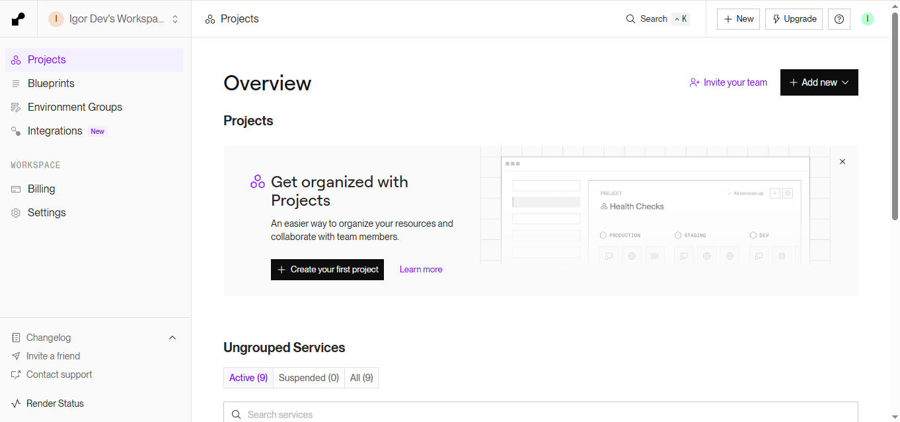
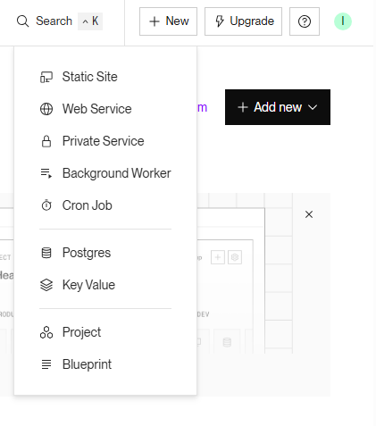
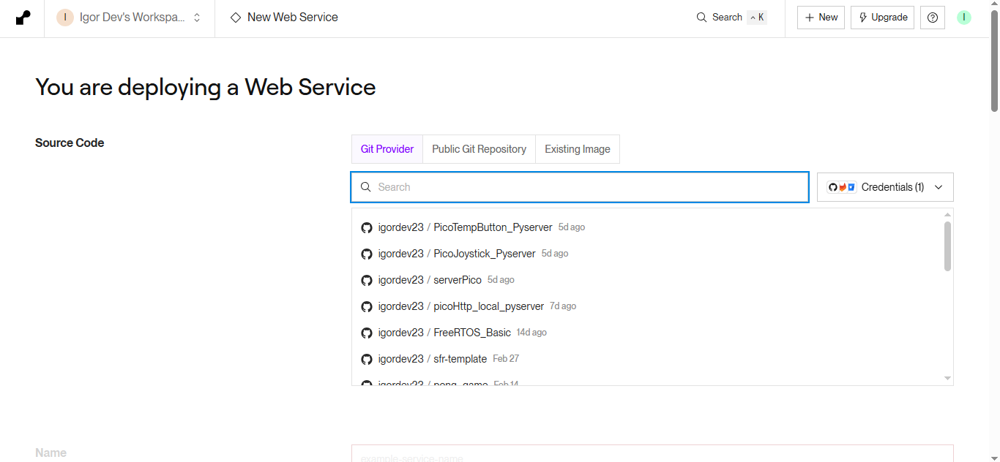
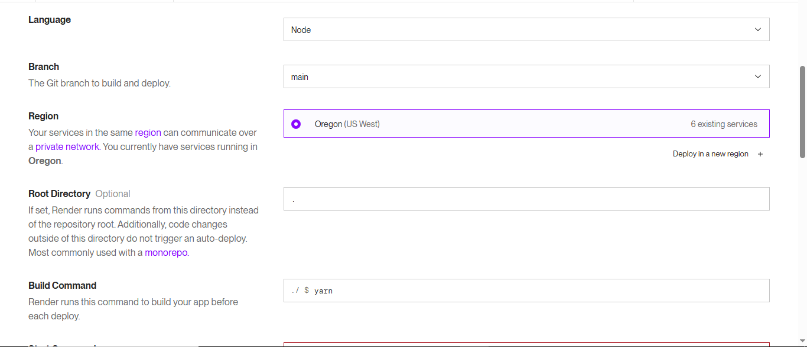

# Configurando a Raspberry Pi Pico W para Enviar a Temperatura do Sensor e o Status do Botão a um Servidor Flask Hospedado no Render

Este projeto utiliza a Raspberry Pi Pico W para ler a temperatura do sensor interno e o estado de um botão, enviando esses dados para um servidor Flask hospedado no Render via requisições HTTP.


## Requisitos

### Hardware:
- Raspberry Pi Pico W
- Conexão Wi-Fi

### Software:
- Raspberry Pi Pico SDK
- CMake
- Toolchain ARM (GCC)
- Python 3
- Flask

## Configuração do Ambiente

### 1. Iniciar um novo projeto com a extensão Raspberry Pico

Você irá iniciar um novo projeto C/C++ e selecionar a Pico W.
Escolha a configuração do SDK de sua preferência, mas se for usar este repositório, utilize a versão 1.5.1.
Selecione a opção "console over USB" e então crie o projeto.

### 2. Instalar Dependências Python (CMD ou PowerShell)

Para o servidor Flask:
```sh
pip install flask
```

## Configuração do Projeto

### 1. Estrutura dos Arquivos
Lembre-se de que o arquivo principal é o `picow_http_client.c`, então ajuste seu CMake conforme necessário.
Certifique-se de ter os seguintes arquivos no diretório do projeto:
```
- CMakeLists.txt
- example_http_client_util.c
- example_http_client_util.h
- lwipopts.h
- lwipopts_examples_common.h
- mbedtls_config.h
- mbedtls_config_examples_common.h
- picow_http_client.c
- picow_http_verify.c
```

### 2. Configuração do CMake

Edite o `CMakeLists.txt` conforme abaixo:
```cmake
# Generated Cmake Pico project file

cmake_minimum_required(VERSION 3.13)

set(CMAKE_C_STANDARD 11)
set(CMAKE_CXX_STANDARD 17)
set(CMAKE_EXPORT_COMPILE_COMMANDS ON)

# Initialise pico_sdk from installed location
# (note this can come from environment, CMake cache etc)

# == DO NOT EDIT THE FOLLOWING LINES for the Raspberry Pi Pico VS Code Extension to work ==
if(WIN32)
    set(USERHOME $ENV{USERPROFILE})
else()
    set(USERHOME $ENV{HOME})
endif()
set(sdkVersion 1.5.1)
set(toolchainVersion 13_2_Rel1)
set(picotoolVersion 2.0.0)
set(picoVscode ${USERHOME}/.pico-sdk/cmake/pico-vscode.cmake)
if (EXISTS ${picoVscode})
    include(${picoVscode})
endif()
# ====================================================================================
set(PICO_BOARD pico_w CACHE STRING "Board type")

# Pull in Raspberry Pi Pico SDK (must be before project)
include(pico_sdk_import.cmake)

project(picow_http_client C CXX ASM)

# Initialise the Raspberry Pi Pico SDK
pico_sdk_init()

pico_add_library(example_lwip_http_util NOFLAG)
target_sources(example_lwip_http_util INTERFACE
        ${CMAKE_CURRENT_LIST_DIR}/example_http_client_util.c
        )
pico_mirrored_target_link_libraries(example_lwip_http_util INTERFACE
        pico_lwip_http
        pico_lwip_mbedtls
        pico_mbedtls
        )
target_include_directories(example_lwip_http_util INTERFACE
        ${CMAKE_CURRENT_LIST_DIR}
        )


# Add executable. Default name is the project name, version 0.1

add_executable(picow_http_client picow_http_client.c )
set(WIFI_SSID "SuaRedeWiFi")
set(WIFI_PASSWORD "SuaSenhaWiFi")
target_compile_definitions(picow_http_client PRIVATE
        WIFI_SSID=\"${WIFI_SSID}\"
        WIFI_PASSWORD=\"${WIFI_PASSWORD}\"
        )

pico_set_program_name(picow_http_client "picow_http_client")
pico_set_program_version(picow_http_client "0.1")

# Modify the below lines to enable/disable output over UART/USB
pico_enable_stdio_uart(picow_http_client 0)
pico_enable_stdio_usb(picow_http_client 1)

# Add the standard library to the build
target_link_libraries(picow_http_client
        
        pico_cyw43_arch_lwip_threadsafe_background
        example_lwip_http_util
        hardware_adc
        pico_stdlib
        )

# Add the standard include files to the build
target_include_directories(picow_http_client PRIVATE
        ${CMAKE_CURRENT_LIST_DIR}
        ${CMAKE_CURRENT_LIST_DIR}/..
)

# Add any user requested libraries
target_link_libraries(picow_http_client 
        
        )

pico_add_extra_outputs(picow_http_client)

add_executable(picow_http_client_verify
        picow_http_verify.c
        )
target_compile_definitions(picow_http_client_verify PRIVATE
        WIFI_SSID=\"${WIFI_SSID}\"
        WIFI_PASSWORD=\"${WIFI_PASSWORD}\"
        # By default verification is optional (MBEDTLS_SSL_VERIFY_OPTIONAL)
        # Make it required for this test
        ALTCP_MBEDTLS_AUTHMODE=MBEDTLS_SSL_VERIFY_REQUIRED
        )
target_include_directories(picow_http_client_verify PRIVATE
        ${CMAKE_CURRENT_LIST_DIR}
        ${CMAKE_CURRENT_LIST_DIR}/.. # for our common lwipopts and mbedtls_config
        )
target_link_libraries(picow_http_client_verify
        pico_cyw43_arch_lwip_threadsafe_background
        example_lwip_http_util
        pico_stdlib
        )
pico_add_extra_outputs(picow_http_client_verify)

# Ignore warnings from lwip code
set_source_files_properties(
        ${PICO_LWIP_PATH}/src/apps/altcp_tls/altcp_tls_mbedtls.c
        PROPERTIES
        COMPILE_OPTIONS "-Wno-unused-result"
        )


```

### 3. Configuração do Wi-Fi

No `CMakeLists.txt`, edite as definições para sua rede Wi-Fi:
```cmake
set(WIFI_SSID "SuaRedeWiFi")
set(WIFI_PASSWORD "SuaSenhaWiFi")
```
### 4. Configurando o endereço do seu servidor

Lembre-se de ajustar o endereço do seu servidor após hospedá-lo online.
Ajuste o endereço na parte do código abaixo:

```C
#define HOST "serverpicoou.onrender.com" // O endereço deve ser sem http:// ou https://
#define URL_REQUEST "/mensagem?msg=" // Não altere essa parte
```
## 5. Hardware Utilizado

Para este projeto, utilizamos os seguintes componentes de hardware:

- **Raspberry Pi Pico W** – Microcontrolador principal responsável por coletar dados e enviá-los ao servidor.
- **Sensor de temperatura interno da Pico W** – Utilizado para medir a temperatura ambiente.
- **Botão (Botão A - GPIO 5)** – Permite alternar entre exibição de temperatura em Celsius e Fahrenheit.
- **Wi-Fi embutido da Pico W** – Para conexão com a internet e envio de dados via HTTP.

Caso deseje expandir o projeto, pode-se integrar sensores externos para medições mais precisas.

### 6. Código C

Este é o código principal para leitura e envio do status do botão e da temperatura medida pelo sensor da Bitdog Lab, nomeado como `picow_http_client.c`

```c
#include <stdio.h>
#include <string.h>
#include "pico/stdlib.h"
#include "hardware/adc.h"
#include "pico/cyw43_arch.h"
#include "lwip/altcp_tls.h"
#include "example_http_client_util.h"

#define HOST "serverpico.onrender.com"
#define URL_REQUEST "/mensagem?msg="

#define SENSOR_TEMP 4  // Canal do sensor de temperatura interno
#define BUTTON_A 5      // GPIO do botão A

#define BUFFER_SIZE 512

bool is_fahrenheit = false;
bool last_button_state = true; // Estado anterior do botão

// Função para codificar URL corretamente
void urlencode(const char *input, char *output, size_t output_size) {
    char hex[] = "0123456789ABCDEF";
    size_t j = 0;
    for (size_t i = 0; input[i] && j + 3 < output_size; i++) {
        if ((input[i] >= 'A' && input[i] <= 'Z') || 
            (input[i] >= 'a' && input[i] <= 'z') || 
            (input[i] >= '0' && input[i] <= '9') || 
            input[i] == '-' || input[i] == '_' || input[i] == '.' || input[i] == '~') {
            output[j++] = input[i];
        } else {
            output[j++] = '%';
            output[j++] = hex[(input[i] >> 4) & 0xF];
            output[j++] = hex[input[i] & 0xF];
        }
    }
    output[j] = '\0';
}

// Envia os dados para o servidor
void send_data(const char* data) {
    char encoded_data[BUFFER_SIZE];
    urlencode(data, encoded_data, BUFFER_SIZE);

    char full_url[BUFFER_SIZE];
    snprintf(full_url, BUFFER_SIZE, "%s%s", URL_REQUEST, encoded_data);

    EXAMPLE_HTTP_REQUEST_T req = {0};
    req.hostname = HOST;
    req.url = full_url;
    req.tls_config = altcp_tls_create_config_client(NULL, 0);
    req.headers_fn = http_client_header_print_fn;
    req.recv_fn = http_client_receive_print_fn;

    printf("Enviando dados: %s\n", data);
    int result = http_client_request_sync(cyw43_arch_async_context(), &req);

    altcp_tls_free_config(req.tls_config);
}

// Inicializa os componentes de hardware
void init_hardware() {
    stdio_init_all();
    adc_init();
    adc_set_temp_sensor_enabled(true);
    adc_select_input(SENSOR_TEMP);

    gpio_init(BUTTON_A);
    gpio_set_dir(BUTTON_A, GPIO_IN);
    gpio_pull_up(BUTTON_A); // Habilita pull-up interno
}

// Lê a temperatura
float read_temperature() {
    uint16_t raw = adc_read();
    float voltage = raw * 3.3f / 4095.0f;
    return 27 - (voltage - 0.706) / 0.001721;
}

// Envia a temperatura
void send_temperature() {
    float temp_c = read_temperature();
    float temp_f = temp_c * 9 / 5 + 32;
    
    char msg[BUFFER_SIZE];
    snprintf(msg, BUFFER_SIZE, "Temperatura: %.2f %s", 
             is_fahrenheit ? temp_f : temp_c,
             is_fahrenheit ? "°F" : "°C");

    send_data(msg);
}

// Envia o estado do botão
void send_button_state(bool pressed) {
    char msg[BUFFER_SIZE];
    snprintf(msg, BUFFER_SIZE, "Botão %s | Modo: %s", 
             pressed ? "pressionado" : "solto",
             is_fahrenheit ? "Fahrenheit" : "Celsius");

    send_data(msg);
}

int main() {
    init_hardware();
    sleep_ms(2000); // Tempo para inicialização

    if (cyw43_arch_init()) {
        printf("Falha ao inicializar Wi-Fi\n");
        return 1;
    }
    cyw43_arch_enable_sta_mode();
    if (cyw43_arch_wifi_connect_timeout_ms(WIFI_SSID, WIFI_PASSWORD, CYW43_AUTH_WPA2_AES_PSK, 10000)) {
        printf("Falha na conexão Wi-Fi\n");
        return 1;
    }

    printf("Conectado! Iniciando leitura...\n");

    while (true) {
        // Verifica o estado do botão
        bool button_state = gpio_get(BUTTON_A) == 0;

        // Se houve mudança no estado do botão, alterna entre Celsius/Fahrenheit e envia o estado
        if (button_state != last_button_state) {
            if (button_state) { // Se pressionado, alterna o modo
                is_fahrenheit = !is_fahrenheit;
                printf("Botão pressionado! Agora está em %s\n", is_fahrenheit ? "Fahrenheit" : "Celsius");
            }
            send_button_state(button_state);
            last_button_state = button_state;
        }

        // Envia a temperatura a cada 1 segundo
        send_temperature();

        sleep_ms(1000);
    }

    cyw43_arch_deinit();
    return 0;
}

```


## Configuração do Servidor Flask

### 1. Disposição dos arquivos

Arquivos necessários para a hospedagem do servidor. Para este projeto, escolhi o Render.
Organize-os da seguinte forma:

```
app.py
static/
    script.js
    styles.css
templates/
    index.html
Procfile
requirements.txt
```

### 2. Criando o arquivo principal

Crie um arquivo `app.py` e adicione o seguinte código:

```python
import os
from flask import Flask, request, jsonify, render_template

app = Flask(__name__)

mensagens = []

@app.route("/mensagem", methods=["GET"])
def receber_mensagem():
    mensagem = request.args.get("msg")
    if mensagem:
        mensagens.append(mensagem)
        print(f"Mensagem recebida: {mensagem}")
    return "Mensagem recebida"

@app.route("/mensagens", methods=["GET"])
def listar_mensagens():
    return jsonify(mensagens)

@app.route("/reset", methods=["POST"])
def resetar_mensagens():
    global mensagens
    mensagens = []
    print("Mensagens resetadas.")
    return "Mensagens resetadas"

@app.route("/", methods=["GET"])
def pagina_inicial():
    return render_template("index.html")

PORT = int(os.environ.get("PORT", 5000))
app.run(host="0.0.0.0", port=PORT)
```

### 3. Criando o arquivo HTML

Crie o arquivo `index.html` dentro da pasta `templates/` e adicione o seguinte código:

```html
<!DOCTYPE html>
<html lang="pt-BR">
<head>
    <meta charset="UTF-8">
    <meta name="viewport" content="width=device-width, initial-scale=1.0">
    <title>Monitoramento</title>
    <link rel="stylesheet" href="{{ url_for('static', filename='styles.css') }}">
</head>
<body>
    <div class="container">
        <h2>Monitoramento</h2>
        
       
        <button class="botao" onclick="mostrarSecao('logs-container')">Ver Logs</button>

       

        <div id="logs-container" class="hidden">
            <h3>Logs do Servidor</h3>
            <div id="mensagens">
                <p>Nenhuma mensagem recebida ainda.</p>
            </div>
            <button class="botao" onclick="resetarMensagens()">Resetar Mensagens</button>
        </div>
    </div>

    <script src="{{ url_for('static', filename='script.js') }}"></script>
</body>
</html>
```

### 4. Criando o arquivo JavaScript

Crie o arquivo `script.js` dentro da pasta `static/` e adicione o seguinte código:

```js
function atualizarMensagens() {
    fetch('/mensagens')
        .then(response => response.json())
        .then(data => {
            let mensagensDiv = document.getElementById('mensagens');
            mensagensDiv.innerHTML = '';

            if (data.length > 0) {
                data.forEach(msg => {
                    let div = document.createElement('div');
                    div.className = 'mensagem';
                    div.textContent = msg;
                    mensagensDiv.appendChild(div);
                });

                let ultimaMensagem = data[data.length - 1];
              
            } else {
                mensagensDiv.innerHTML = '<p>Nenhuma mensagem recebida ainda.</p>';
            }
        });
}


function resetarMensagens() {
    fetch('/reset', { method: 'POST' })
        .then(() => atualizarMensagens());
}

function mostrarSecao(selecao) {
  
    document.getElementById('logs-container').style.display = 'none';
    document.getElementById(selecao).style.display = 'block';
}

setInterval(atualizarMensagens, 2000);
```

### 5. Criando o arquivo CSS

Crie o arquivo `styles.css` dentro da pasta `static/` e adicione o seguinte código:

```css
body {
    font-family: Arial, sans-serif;
    text-align: center;
    margin-top: 50px;
}

.container {
    padding: 20px;
    border: 1px solid #ddd;
    display: inline-block;
}

.botao {
    margin: 10px;
    padding: 10px;
    background: red;
    color: white;
    border: none;
    cursor: pointer;
    border-radius: 5px;
}

.hidden {
    display: none;
}

.mensagem {
    background: #f4f4f4;
    padding: 10px;
    margin: 5px;
    border-radius: 5px;
}

#mensagens {
    max-height: 300px;
    overflow-y: auto;
    border: 1px solid #ddd;
    padding: 10px;
    background: #f4f4f4;
    text-align: left;
}
```

### 6. Criando o arquivo Procfile

Crie o arquivo `Procfile` com o seguinte conteúdo:

```
web: python app.py
```

### 7. Criando o arquivo `requirements.txt`

Crie o arquivo `requirements.txt` com o seguinte conteúdo:

```
Flask
gunicorn
```
## Hospedagem do Servidor Flask

Com seus arquivos configurados e prontos, vamos colocar seu servidor online.

### 1 Enviando o servidor para o GitHub

Primeiro, envie o código do servidor para um novo repositório no GitHub usando o Git:
```git
git init
git add .
git commit -m "Primeiro commit"
git branch -M main
git remote add origin https://github.com/seu-usuario/seu-repositorio.git
git push -u origin main
```
### 2 Configurando o Render

Após o repositório estar no GitHub, vamos fazer a hospedagem no Render.

Acesse Render e crie uma conta.

No dashboard do Render, clique no botão New no canto superior direito.




Escolha a opção Web Service.



Conecte sua conta do GitHub e selecione o repositório onde está o servidor Flask.


O Render configurará automaticamente o ambiente. Apenas ajuste o campo Root Directory, 
digitando apenas:
```txt
.

```


Se for apenas para testes, selecione Instance Type: Free.

Clique no botão Deploy Web Service.

### 3 Testando o servidor

Enquanto o Render faz o deploy, ele irá gerar um link semelhante a este:

https://serverpicooo.onrender.com

Copie esse link e configure-o no seu código C conforme mostrado nos passos anteriores. Após finalizar o deploy, verifique no Serial Monitor se a temperatura e o status do botão estão sendo enviados corretamente. Agora você pode acompanhar em tempo real as leituras do sensor e os logs do servidor no endereço do seu servidor. É só clicar no link gerado.

